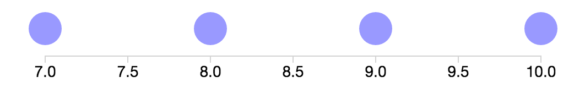

# Displaying Axes Exercise

This exercise is a quick look at how to render an axis alongside a simple (1-D) dataset. Open the file `axisExercise.html` to get started. Instructions are in the code. 

Your final product should look like this:

Complete example can be [found here](https://codepen.io/molliemarie/pen/jxbQdB?editors=1000).
