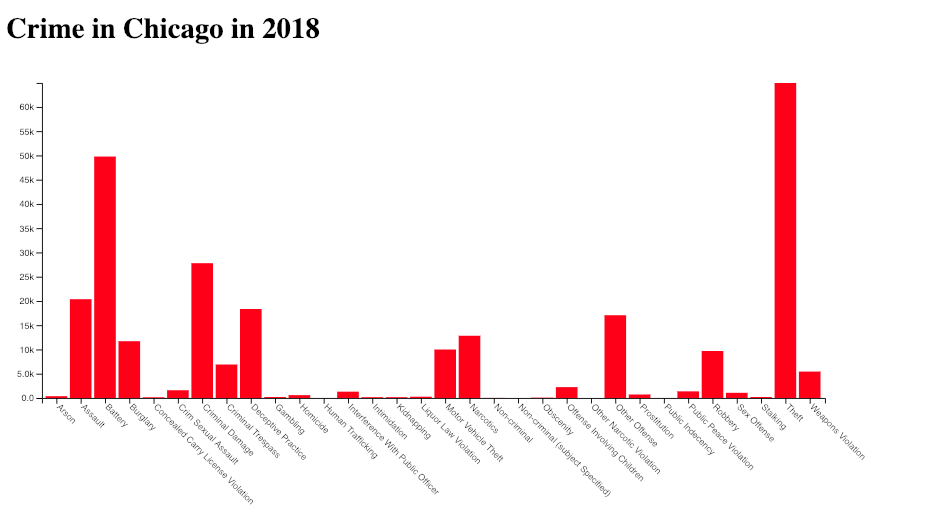
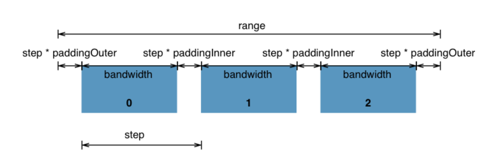

# Bar plot of Chicago Crime

Now we'll be creating our first bar plot! We'll be using Chicago crime data, which is available on the [Chicago Data Portal](https://data.cityofchicago.org/Public-Safety/Crimes-2001-to-present/ijzp-q8t2). For creation of this plot, I have aggregated the data to find the total counts of each type of crime for each year. (See ipython notebook where I did this [here](data/transformChiCrimeData.ipynb).) Before getting started, open the data file (`ChiCrime.csv`) to see how the data is structured.

We're going to create a bar plot, showing the counts of each crime in Chicago. It will end up looking something like this:



To get started, open up the file `barPlotStart.html` and follow the following instructions. The first several steps should look familiar, as they will similar to (or the same as) steps taken when making the scatter / line plot. I've provided less specific instructions for these steps. If your memory needs refreshed, I'd recommend looking at the earlier plots we created to refresh your memory. 

If you get stuck consider reading documentation, googling around a bit, or working together with a friend before asking for help. Additionally, you'll find the finished code as well as the various steps within this folder, but I'd recommend trying to work through the steps without looking at the finished code if possible.

And, here we go!

## Bar Plot Steps

1. Using Mike Bostock's [margin conventions](https://bl.ocks.org/mbostock/3019563) to define the `margin`, `width`, `height`, and `svg`.

Now, let's create our scales! 

2. We'll start with our x scale. Because our x axis this time around is ordinal rather than linear, we'll be using a new scale for this plot. Specifically, we'll be using a [d3 band scale](https://github.com/d3/d3-scale/blob/master/README.md#scaleBand). Band scales are like [ordinal scales](https://github.com/d3/d3-scale/blob/master/README.md#ordinal-scales) except the output range is continuous and numeric. Discrete output values are automatically computed by the scale by dividing the continuous range into uniform bands. Band scales are typically used for bar charts with an ordinal or categorical dimension. 



**Note:** Because the domain requires access to the data, we will only define the range here. Later, we will define the domain within the `ready` function.

Let's define our xScale like so:

```
var xScale = d3.scaleBand()
  .rangeRound([0, width]);
```

Read more about why we use `.rangeRound()` [here](https://github.com/d3/d3-scale#continuous_rangeRound)

3. Next, I'd like you to think about what scale you'll be using for the y axis, which shows the count values. Think back to scales we used with our scatter / line plot. 

Now, define the yScale using the scale you've chosen. How should we define the range?

```
var yScale = //use correct scale type here
  .range([ , ]); //fill in range values
```

4. Define the `xAxis` and `yAxis` variables using `d3.axisBottom()` and `d3.axisLeft()`. This should seem familiar from our scatter plot. 

Let's now move inside the `ready` function to define our scale domains, axis groups, and create our bars!

5. Since our y axis is a linear scale of counts, you will set this domain similar to how you did for the scatter plot. In that example, we used `d3.extent()`. However, `d3.extent` uses the min and max values from the data, and I'd like our minimum value to always be `0`. Therefore, rather than using `d3.extent` for our `yScale` domian, set the lower bound to `0`, and the upper bound to the max count value in `data` using [`d3.max()`](https://github.com/d3/d3-array#max).

6. Since this is a bar plot with a non-numbered, non-date scale, our x axis domain will be a bit different than we've seen so far. We simply want a list of violations in our x axis. Therefore, we'll use `d3.map()` to obtain such a list, like so:

```
xScale.domain(data.map(function(d) { return d.violation; }));
```

You'll notice our axes are still not showing up. This is because we have not yet created our axis groups that will contain all our axis information (axis labels, ticks, etc.)

7. Create variables `xAxisGroup` and `yAxisGroup`. To create each, you will be appending a `g` tag to the svg, assigning a class of `axis` and `x` or `y`, and calling the appropriate axis. If necessary, use `transform`, `translate` to move the axis to the right location. This should seem familiar from our scatter plot creation last week. 

8. Now, let's create our bars! Here's an example of what this could look like the following. Read the comments for explanation of what's 

```
  svg.selectAll(".bar") 
    .data(data) 
    .enter().append("rect")
    .attr("class", "bar")
    .attr("x", function(d) { return xScale(d.violation); }) 
    .attr("y", function(d) { return yScale(d.count); })
    .attr("width", xScale.bandwidth()) 
    .attr("height", function(d) { return height - yScale(d.count); }) /
    .style("fill", "red") //assign a color of red.
```

Let's talk about what's happening here:

- We select all elements with the class `bar`, which in this case do not yet exist
- We bind the data to the selected elements, creating placeholders
- We choose the `enter()` selection (we'll go into what this is in more detail next class) and append a rectangle for each placeholder element that was created during the data bind
- Next, we assign a variety of attributes. (The necessary attributes for a bar plot are `x`, `y`, `width`, and `height`.)
- We first assign a class of `bar` to each rectangle element
- The x coordinates are determined based on the x scale we created, `xScale`; the x Band Scaling Function takes in the x and produces a number in the range specified by rangeRound.
- The y coordinates are determined based on the y scale we created, `xScale`; the y coordinate is determined by passing the frequency of the data object bound to the specific element to the y linear scaling function.
- The width of the rectangle is determined by the rangeBand of the x band scaling function. Luckily, d3 does this calculation for you when you create the scale so that you don't have to; all you need to do is call assign the width of the bar to the `bandwidth` associated with the scale you created.
- Height is calculated for each rectangle. We've already determined the y values, so what is it that the height is doing? I'd like you to look at how we're calculating this. The height of the rectangle is calculated as the difference of the height of the inner drawing space and the value assigned to count after it has gone through the y linear scaling function. This is done in this way because the Y axis has been inverted by the y scaling function for values passed into it, but not for the construction of SVG Rectangles. I suggest you draw a picture of what's happening here. Try out some calculations by hand to get a better understanding of what's being done. (We can also go over this at the start of next class if necessary). 
- A fill is assigned to each rectangle. In this example, they are given a fill of red, but you can choose whichever color you like.

I suggest you take a look at the developer tools in the `elements` section to really drive this point home.

We have now created a bar plot, but it doesn't look very pretty. Let's add some styling!

## Styling

9. First of all, we can't read either of our axes. The y axis is easiest to fix, so let's start there. Adjust the left margin so that we can see the y axis labels.

10. Now, let's do some adjustment to the x axis so that we can read all of these labels. 

a) We can start by using `transform, rotate` to make it so that the words don't overlap. 

Below where you assigned the variable `xAxisGroup`, insert the following code

```
  xAxisGroup
    .selectAll('text')
    .attr('transform', 'rotate(45)')
```

What you're doing here is selecting the text and rotating the text forty-five degrees. Now save and refresh your page to see happened.

b) 

You'll see that this doesn't look quite right yet. This is because by default, the text is anchored in the middle of the word. We can fix this be assigning a different `text-anchor`, like so:

```
  xAxisGroup
    .selectAll('text')
    .attr('transform', 'rotate(45)')
    .style('text-anchor', 'start');
```

c) That looks much better, but the text is still being cut-off. Fix this by adjusting the bottom margin so that you can see all of the text. (You may need to adjust the right margin as well.)

d) Ok, it's almost there, but upon closer inspection one can see that the words are still a bit off. Let's use `transform, translate` to adjust the words in the x and y direction. You don't need a new line for this, but can actually assign `translate` right along with `rotate`, like so:

```
  xAxisGroup
    .selectAll('text')
    .attr('transform', 'rotate(45) translate(x, y)') //replace `x` and `y` with numbers. Play around; try out different x and y values until it looks right.
    .style('text-anchor', 'start');
```

11. Right now the bars are right next to one another. Let's add some padding between the bars. You can define padding when you first assign `xScale`, like so:

```
var xScale = d3.scaleBand()
  .padding([.1])
  .rangeRound([0, width]);
```

12. Add a title. You'll need to add a new `div` within the `body` element in the html section. You can then simply add a `h1` tag within this new div.

13. Perhaps you'd also like to add some text formatting to the y axis. For example, instead of reading 10,000, 15,000, etc., let's change the y axis so that it reads 10k, 15k, 20k, etc. You will do this using `.tickFormat`, like so:

```
var yAxis = d3.axisLeft(yScale)
  .tickFormat(d3.format(`.2s`));
```

Check out the [`d3-format` documentation](https://github.com/d3/d3-format) and try playing around with different formatting options.

14. I personally don't like having all of the words capitalized in the x axis. Let's fix this! Try googling around for a function that you could utilize that would capitalize only the first letter of each word. There are often many ways to do this in [stack overflow](https://stackoverflow.com/questions/32589197/capitalize-first-letter-of-each-word-in-a-string-javascript/32589256).

15. I'd at this point encourage you to play around with the styling of the axis labels. Do this within the css section, in the `style` tags. Try changing the font, font-size, fill, etc. Make it look nice! 

You could also format the title font.

16. I am not going to provide specific instructions for interactions for this plot. Instead, what I'd like you to do is brainstorm on the type of interactions you might like to add. Do you want to add hover interactions? If so, what kind? Perhaps you'd like to add other years of data and the ability to toggle in between, or maybe you'd like to grab data from another city and allow people to compare. Then, think about how you might accomplish adding those interactions. You can use past examples as inspiration, or try searching in [block builder search](https://blockbuilder.org/search). 

You're encouraged to try some things on your own or with a friend before asking for help. Much of the d3 learning process is searching, trying, and failing before succeeding. Don't get discouraged! 

But also, you're absolutely welcome to ask questions as well. :) 

16. Post to [bl.ocks](https://bl.ocks.org/)
