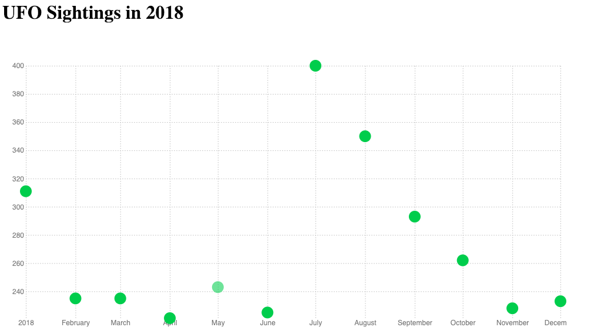

For this first project, we're going to use data from [The National UFO Reporting Center](http://www.nuforc.org/), a website where people can report UFO sightings.

We'll make a fairly basic plot with no interactions to start that will end up looking something like this:



**Note:** Since Mike doesn't [technically](https://bl.ocks.org/mbostock/3887118) make valid HTML pages, we're not going to either — here's how we'll start our own empty HTML pages from here on out:

  ```
  <!DOCTYPE html>
  <meta charset="utf-8">

  <style type="text/css">
    /*css to go here*/
  </style>

  <body></body>

 <script src="https://d3js.org/d3.v4.min.js"></script>
 
  <script>
    //JS to go here
  </script>

  ```
  
  **Steps:**
  
1. First, open the file `scatterStarter.html` and fork it. You'll notice the code is set up like above, plus I've added styling that will add a pink border around any svg we might draw.

  ```
  svg {
    border: 1px solid #f0f;
  }
  ```
  
2. think about the format we want our data in.
3. Add an SVG element of width 720 and height 400.
4. Using a data join, add a `circle` for every element of our array. Give it a radius 5 and a class, `ufoCircle'. Inspect it in the console. (You can pull up a Javascript console by clicking console in the bottom left corner of the pen)
 5. Position the circles based on their `cx` and `cy` attributes. How does SVG interpret these positions?
 6. We'll need to add a [scale](https://github.com/d3/d3-scale/blob/master/README.md).
 7. Let's label the count of each using text. At this point, we'll talk about how we can avoid this second data join and make our code a bit more efficient.
 8. Redo the original join, using groups first, then appending circles and text. Note SVG [transformation](http://www.w3.org/TR/SVG/coords.html) documentation, which is not that fun. 
 9. Maybe [axes](https://github.com/d3/d3-axis/blob/master/README.md) are in order?  
 10. We might need to move our axes around. We'll go through the math. Also, maybe add some styles?
 11. The margins are a problem, and they will always be. Here's [a great trick](https://bl.ocks.org/mbostock/3019563) we'll use on every chart we make from here on out.
 12. Let's style the chart to match the example. Things like [tickSize](https://github.com/d3/d3-axis/blob/master/README.md#axis_tickSize) might help.
 13. Let's add a title
 
Alright, we've done a lot! What we have should look pretty similar now to the plot above. Unfortunately, though, our chart isn't really better than what we get with the free tools. (Paste your data into [Chartbuilder](http://quartz.github.io/Chartbuilder/) and feel free to weep.) What makes D3 different is its ability to create **dynamic** and **custom** visualizations and things that tools aren't designed to create. To demonstrate this, tomorrow (and today if time) we will add some interactions to the plot to make it a bit more interesting!
 
 If time...
 
 14. Add hover interactions that will
     - make the text only appear on hover
     - make the circle increase in size when hovered upon, and go back to normal if the mouse moves
     - when a circle is hovered, all other circles become slightly transparent (by assigning a lower opacity)
 15. Load in data from a file rather than written out as we have it
 16. Now that we've done that, we can see many years of data at once! We'll need to do some filtering.
 
 
