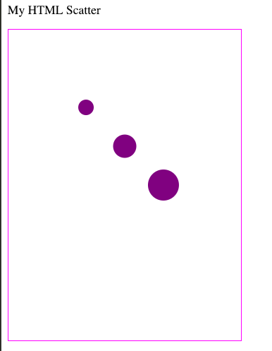

# Creating a "scatter plot" using html

This is an exercise to practice basic HTML, SVG, and CSS syntax. It is also designed to demonstrate that something that _looks like_ a chart on a website is actually just a collection of simple HTML elements. The final example for all three plots should look like the image below. (You can also see a completed example [here](https://codepen.io/molliemarie/pen/aQrGYg).)



You'll want to open up your `htmlScatter.html` file in a text editor, and then perform the following steps (instructions are also in the file):

- Make a container `<div>` in which you'll render your content 
- Create a `<p>` element in which you write "My HTML Scatter" 
- Make a container `<svg>` element in which you'll place your circles 
- Set your svg's `width` to 300, and `height` to `400` 
- Put 3 `<circle>` elements inside of your `<svg>`, setting the properties for each one: 
    - `cx`: How far to move the circle in the `x` direction (right). Should be 100, 150, and 200. 
    - `cy`: How for to move the circle in the `y` direction (down from the top). Should be 100, 150, and 200. 
    - `r`: circle radius. Should be 10, 15, and 20. 

- In the `<style>` section, set `circle` elements to have a "fill" of whatever color you like.

## Creating a "scatter plot" using D3
This is an exercise to practice manipulating the DOM with D3. You can also see a completed example [here](https://codepen.io/molliemarie/pen/RqmyaW).

You'll want to open up your `d3Scatter1.html` file in a text editor, and then perform the following steps (instructions are also in the file). All steps will be completed using d3.js, and should be completed in the `<script>` section at the bottom of the `d3Scatter1.html` file.

- Select your `body` and append a `div` element in which you'll render your content. To do this, you'll use the `d3.select()` method, and then the `.append()` method to append your element to your selection.
- Append a new `p` element to the `div` you just created, and use the `.text()` method to set the text to "My First D3 Scatter"
- Append a container `svg` to your `div` element in which you'll place your circles 
- Set your svg's `width` to 300, and `height` to `400` 
- Append 3 `circle` elements inside of your `<svg>` (one at a time), setting the properties for each one. We'll improve on this process later: 
    - `cx`: How far to move the circles in the `x` direction (right). Should be 100, 150, and 200. 
    - `cy`: How for to move the circle in the `y` direction (down from the top). Should be 100, 150, and 200. 
    - `r`: circle radius. Should be 10, 15, and 20.
    
## Creating a scatter plot using D3 and data joins
This is an exercise to practice manipulating the DOM D3 using the **data-join**. You can also see a completed example [here](https://codepen.io/molliemarie/pen/rQgvmQ).

You'll want to open up your `d3DataJoinScatter.html` file in a text editor, and then perform the following steps (instructions are also in the file). All steps will be completed using d3.js, and should be completed in the `<script>` section at the bottom of the `d3DataJoinScatter.html` file. Preliminary steps have been completed for you.

- Append 3 `circle` elements inside of your `<svg>` **using the data join**. To do this, you'll use the following syntax:

```js
// Select all circles in the svg and bind your data to the selection
var circles = svg.selectAll('circle')

// Determine what's new to the screen using `.enter()` and for each new element, append a circle
// Then, use the data provided to set the desired attributes
circles.enter()
    .append('circle')
    .attr('cx', function(d) { return d.cx})
    .attr('cy', function(d) { return d.cy})
    .attr('r', function(d){return d.r})

```
    - `cx`: How far to move the circles in the `x` direction (right). Should be 100, 150, and 200. 
    - `cy`: How for to move the circle in the `y` direction (down from the top). Should be 100, 150, and 200. 
    - `r`: circle radius. Should be 10, 15, and 20.
