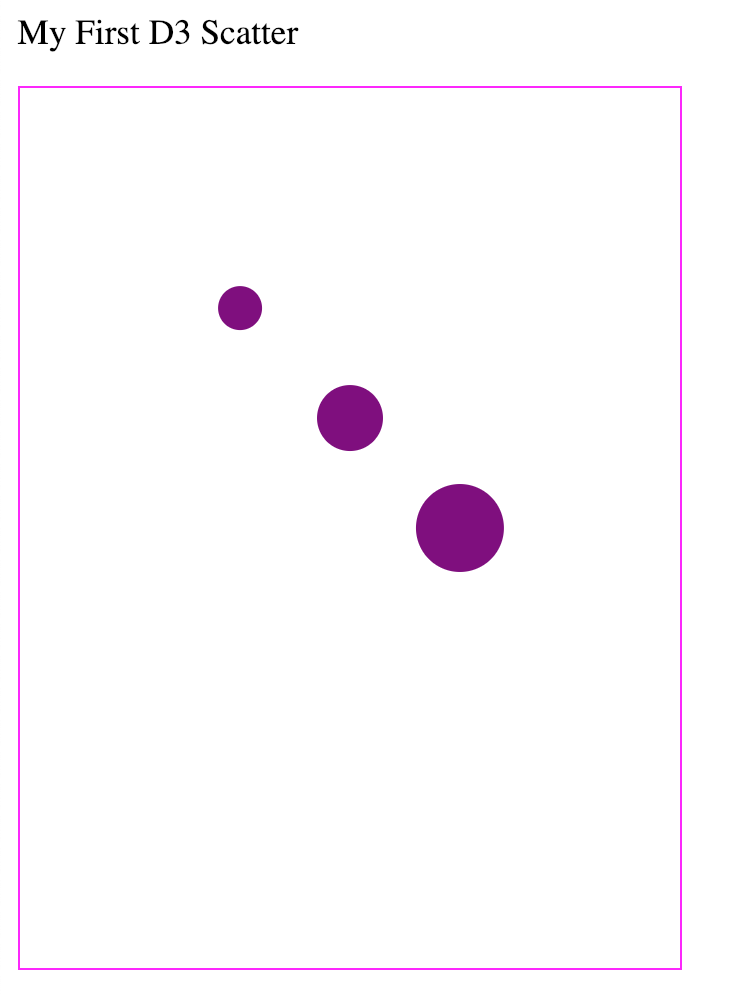

## Lab 2
This is an exercise to practice manipulating the DOM with D3. The final example should look like this (you can also see the `complete.html` file for answers):

You'll want to open up your `index.html` file in a text editor, and then perform the following steps (instructions are also in the file). All steps will be completed using d3.js, and should be completed in the `<script>` section at the bottom of the `index.html` file.

- Select your `body` and append a `div` element in which you'll render your content. To do this, you'll use the `d3.select()` method, and then the `.append()` method to append your element to your selection.
- Append a new `p` element to the `div` you just created, and use the `.text()` method to set the text to "My First D3 Scatter"
- Append a container `svg` to your `div` element in which you'll place your circles 
- Set your svg's `width` to 300, and `height` to `400` 
- Append 3 `circle` elements inside of your `<svg>` (one at a time), setting the properties for each one. We'll improve on this process later: 
    - `cx`: How far to move the circles in the `x` direction (right). Should be 100, 150, and 200. 
    - `cy`: How for to move the circle in the `y` direction (down from the top). Should be 100, 150, and 200. 
    - `r`: circle radius. Should be 10, 15, and 20.
