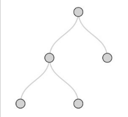
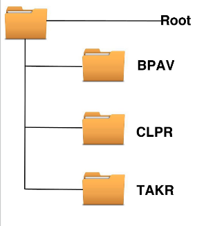
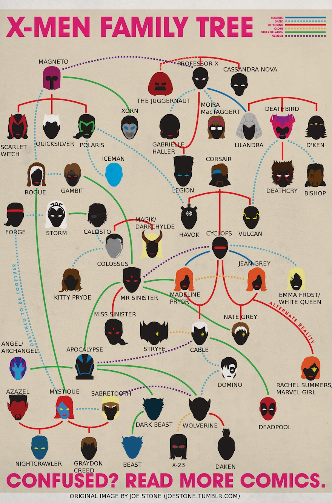
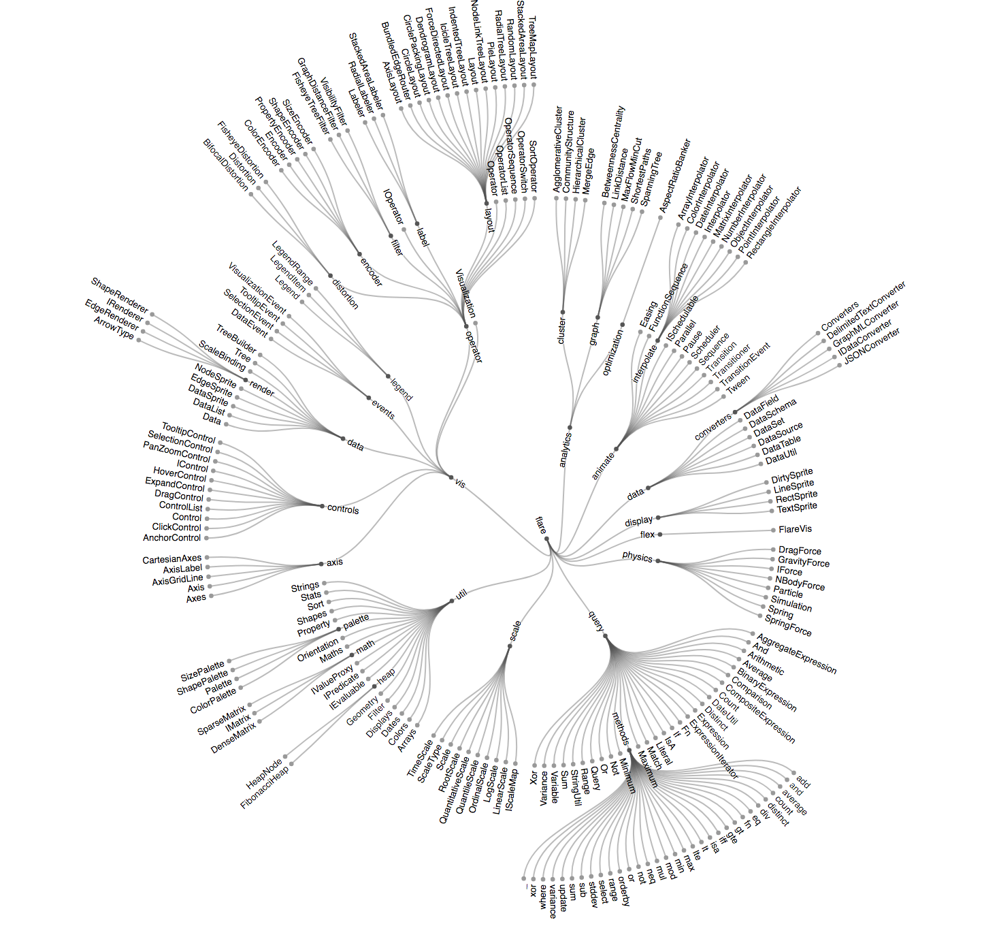
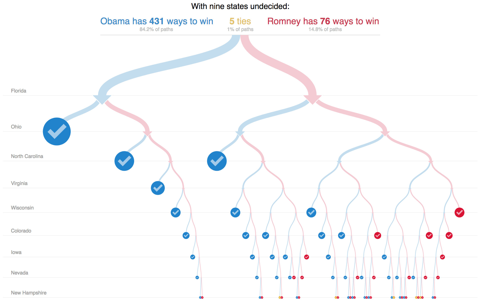
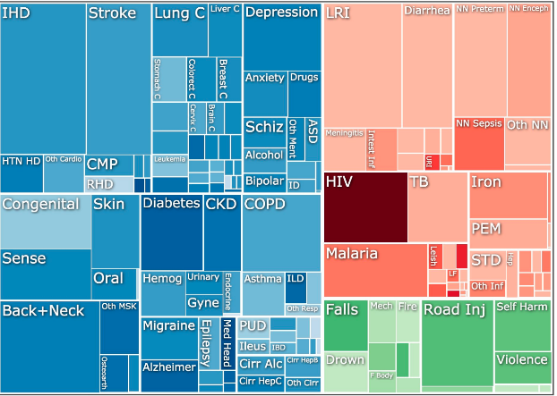
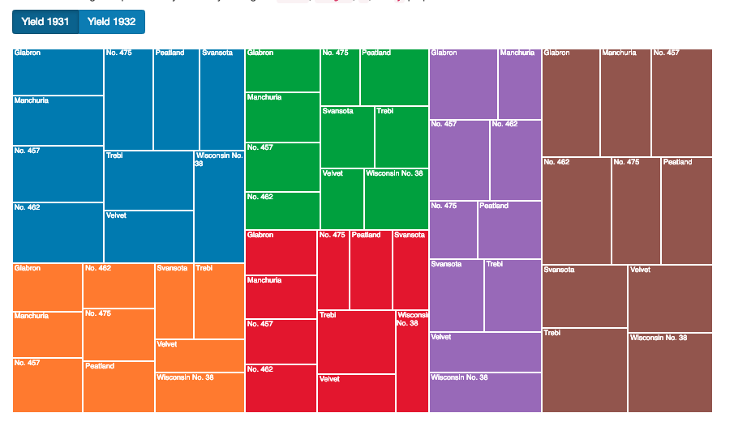

# Hierarchical Data, Nested Data and Our First Tree Map

## What is Hierarchical data?

"A hierarchical database model is a data model in which the data is organized into a tree-like structure. The data is stored as records which are connected to one another through links. A record is a collection of fields, with each field containing only one value."

A simple example:



Some characteristics to note:

  - Connected graph with N-1 edges
  - nodes as *parents* and *children* (hierarchical)
  - single *root* node

### What information exists in a tree structure?

#### Computer Documents



#### Families / Organizations



#### Classifications / Categorizations



From [this bl.ocks](https://bl.ocks.org/mbostock/4063550) that shows the [flare](http://flare.prefuse.org/) class hierarchy.

#### Decisions



This is from the [2012 NYT Electoral Example](http://www.nytimes.com/newsgraphics/2012/10/12/electoral-calculator/945499ae1d8895edd03ba58bf016abaf36b8f039/iframe.html).

#### Diseases



Link to interactive example [here](https://vizhub.healthdata.org/gbd-compare/)

### Resources

- [The Book of Trees: Visualizing Branches of Knowledge](https://www.amazon.com/Book-Trees-Visualizing-Branches-Knowledge/dp/1616892188)

## What is [`D3.nest`](https://github.com/d3/d3-collection#nest)?

"Nesting allows elements in an array to be grouped into a hierarchical tree structure; think of it like the GROUP BY operator in SQL, except you can have multiple levels of grouping, and the resulting output is a tree rather than a flat table. The levels in the tree are specified by key functions. The leaf nodes of the tree can be sorted by value, while the internal nodes can be sorted by key. An optional rollup function will collapse the elements in each leaf node using a summary function. The nest operator (the object returned by nest) is reusable, and does not retain any references to the data that is nested."

## Building a Treemap using `d3.nest`

### The Data

As William S. Cleveland puts it in [Visualizing Data](https://books.google.com/books/about/Visualizing_Data.html?id=V-dQAAAAMAAJ):

 > In the early 1930s, agronomists in Minnesota ran a field trial to study the crop barley. At six sites in Minnesota, ten varieties of Barley were grown in each of two years. The data are the yields for all combinations of site, variety and year, so there are 6 x 10 x 2 =120 observations.
 
 ### Starter File

Open the data file `barley.tsv` ('tsv' stands for tab-separated values); look over the data and familiarize yourself with what we're about to plot.

Additionally, look through the starter file, `treeMapStarter.html`. There are a few things to note. 

1) The CSS is no longer being added within the HTML file. Instead, the CSS is in a `css` file in the folder also called `css`. The file is being brought into this file via the following line:

```
<link rel="stylesheet" href="css/main.css" />
```

2) We're also pulling in a couple other javascript libraries - jquery and bootstrap - plus the bootstrap css via the following lines:

```
    <script src="https://code.jquery.com/jquery.min.js"></script>
    <link href="https://maxcdn.bootstrapcdn.com/bootstrap/3.3.5/css/bootstrap.min.css" rel="stylesheet" type="text/css" />
    <script src="https://maxcdn.bootstrapcdn.com/bootstrap/3.3.5/js/bootstrap.min.js"></script>
```

### Finished Product:

You're finished product will look like this:



### Steps:

1) First, we're going to use [`d3.nest`](https://github.com/d3/d3-collection#nests) to structure our data hierarchically, passing in site as the key. Our code will look like this:

```
    var nestedData = d3.nest()
        .key(function(d) { return d.site; })
        .entries(data);
```

so that you can take a look at what this looks like, add the following line below:

```
    console.log('nestedData', nestedData)
```
and then take a look at the console. You'll see the original data is already being printed in the console. Expand each and compare the structures.

2. Now, let's define a hierarchy for the data using [`d3.hierarchy`](https://github.com/d3/d3-hierarchy/blob/master/README.md#hierarchy) and print the resultant data to the console, like so:

```
    var root = d3.hierarchy({
        values: nestedData
    }, function(d) {
        return d.values;
    });

    console.log('root', root)
```

Go to your console and expand the data to take a look at the new structure.

3. Now, we're going to create a treemap function that will compute your layout given your  data structure using [`d3.treemap()`](https://github.com/d3/d3-hierarchy/blob/master/README.md#treemap), which "lays out the specified root hierarchy, assigning the following properties on root and its descendants:

- node.x0 - the left edge of the rectangle
- node.y0 - the top edge of the rectangle
- node.x1 - the right edge of the rectangle
- node.y1 - the bottom edge of the rectangle"

We'll start out by assigning [`treemap.size`](https://github.com/d3/d3-hierarchy/blob/master/README.md#treemap_size), which "sets this treemap layout’s size to the specified two-element array of numbers [width, height] and returns this treemap layout. If size is not specified, returns the current size, which defaults to [1, 1]" and [`treemap.tile`](https://github.com/d3/d3-hierarchy/blob/master/README.md#treemap_tile) which "sets the [tiling method](https://github.com/d3/d3-hierarchy/blob/master/README.md#treemap-tiling) to the specified function and returns this treemap layout. If tile is not specified, returns the current tiling method, which defaults to [d3.treemapSquarify](https://github.com/d3/d3-hierarchy/blob/master/README.md#treemapSquarify) with the golden ratio." We'll be assigning [`d3.treemapResquarify`](https://github.com/d3/d3-hierarchy/blob/master/README.md#treemapResquarify) because "this tiling method is good for animating changes to treemaps because it only changes node sizes and not their relative positions, thus avoiding distracting shuffling and occlusion."

Our code will look like this: 

```
    var treemap = d3.treemap() // function that returns a function!
        .size([width, height]) // set size: scaling will be done internally            
        .tile(d3.treemapResquarify)
        .padding(0); //padding between groups
```

4. Now, let's create a function that will reset the treemap. As you may have noticed in the `d3.treemap` documentation, "you must call [`root.sum`](https://github.com/d3/d3-hierarchy/blob/master/README.md#node_sum) before passing the hierarchy to the treemap layout."

```
    var setTreemap = function(year) {
        // Redefine which value you want to visualize in your data by using the `.sum()` method
        root.sum(function(d) {
            return +d['yield_' + year];
        });

        // (Re)build your treemap data structure by passing your `root` to your `treemap` function
        treemap(root);
    }
    
    // Now, call your set Treemap function
    setTreemap(year)    
```

5. Now, let's create an ordinal color scale. To do this we'll need to:

- get a list of sites from our nested data object. 
- Use `d3.scaleOrdinal` to create an ordinal scale. Your domain will be your site names and your range should be the colors stored in the variable `d3.schemeCategory10` (or you can choose from one of the other [d3 chromatic scales](https://github.com/d3/d3-scale-chromatic/blob/master/README.md#schemeCategory10)).

So, first, use `map` to get a list of sites. Since we're going to be passing in our nested data, we'll be returning `d.key` to the list. Like so:

```
    var sites = nestedData.map(function(d) {
        return d.key;
    });
```

Now, set an ordinal scale for colors:

```
    var colorScale = d3.scaleOrdinal().domain(sites).range(d3.schemeCategory10);
```

6. Ok, one more big step before we start seeing something on the page. We need to bind our data to a selection fo elements. Let's use the class `node` for this. The data that you want to join is array of elements returned by [`root.leaves()`](https://github.com/d3/d3-hierarchy/blob/master/README.md#node_leaves) (which returns the array of leaf nodes in traversal order; leaves are nodes with no children).

First, let's start by selecting all elements with class `node` and binding the data `root.leaves()`. Let's also print them to the console so that we can take a look:

```
    var nodes = div.selectAll(".node").data(root.leaves());

    console.log('nodes', nodes)
```

As you'll remember from earlier (and can see for yourself if you expand the `root` data or `nodes` in the console), each node has been assigned an `x0`, `x1`, `y0`, and `y1` value. (See step 3 to remind yourself what they are.)

Now, enter and append the elements and position them using the appropriate styles. We'll first append a `div`, assign the class `node`, and add text corresponding to the barley variety. Then use styles to assign `left`, `top`, `width`, and `height` - using our `x0`, `x1`, `y0`, and `y1` values - to assign the location and size of each rectangle. Lastly, we'll assign the `background` using the colorscale. 

```
    nodes.enter()
        .append("div")
        .attr('class', 'node')
        .text(function(d) {
            return d.data.variety;
        })
        .style("left", function(d, i) {
            return d.x0 + "px";
        })
        .style("top", function(d) {
            return d.y0 + "px";
        })
        .style('width', function(d) {
            return d.x1 - d.x0 + 'px';
        })
        .style("height", function(d) {
            return d.y1 - d.y0 + "px";
        })
        .style("background", function(d, i) {
            return colorScale(d.data.site);
        });
```

And voila! We have a treemap! :D However, you'll notice that the buttons do not yet work. Let's fix that.

## Buttons

You'll notice some code already started in the file. 

```
    $("input").on('change', function() {
        // Reset the value of your year variable
        year = $(this).val()

        // Call your setTreemap function to describe that you want to visualize new data


        // Perform a data-join between you selection of elements with class node and the array of objects returned by root.leaves()


        // Assign the position of your div by setting the width, height, x, and y properties 

    });
```

This `$("input").on('change', function() {...` is [jquery](https://www.w3schools.com/JQuery/) for "listen to change events on the input elements. If you don't know what I mean by "input elements", take a quick look at the button html at the top of the code. You'll notice input values associated with each button. Therefore, whenever one of the buttons are pushed, this change event will fire.

Note: The reason we can use jquery is because we load the library in the `head` section at the top of the page. Feel free to find it at the top of the file.

```
<script src="https://code.jquery.com/jquery.min.js"></script>
```

You'll likely recall that we created buttons and listened for change events differently in with our scatter plot example. There are many ways in which things like this can be done - using vanilla javascript, d3.js, and jquery being some examples. It helps to keep this in mind since you'll not always be working in a vacuuum; you're bound to encounter others who do things differently.

Ok, let's move on...

7. First, we need to reset the value of the year variable. Do you remember the javascript keyword [`this`](https://www.w3schools.com/js/js_this.asp)? It allows us to grab information from the element in question - in this case, the button we just pushed. 

Now, look again at the button html. What is it from within each input that we'd like to grab? If you're not sure, look again at the `setTreemap` function we created. What value is needed? Try giving it a look before moving on.

.

.

.

.

.

.

.

.

You'll notice that what we need is the year value. Let's use jquery again to grab `this` (in other words, the input value of the button we pushed); then, we can use `.val()` to grab the assigned value. Like so:

```
var year = $(this).val()
```

8. Now, we can pass in the year to the `setTreemap` function to allow for visualizing of the new data. 

```
setTreemap(year)
```

9. Reassign the `nodes` variable. Then, assign the position of your div by setting the `top`, `left`, `width`, and `height` properties using a transition. Look at step 6 for help.

## Moving Forward:

If you have some time, there are a couple things you could do to practice:

1) Try altering the update section (currently done using jquery) so that it is done using d3.js instead. You can look at the `steps1_withD3Funct.html` file for help.

2) As usual, we've created some redundancies here when drawing and then redrawing our plot. if you have time, take a moment to create a `draw` function to remove these redundancies. Use past examples for help if necessary. 

When you're ready, post your new plot to [bl.ocks](/TechnicalSetup/blocks.md)!


