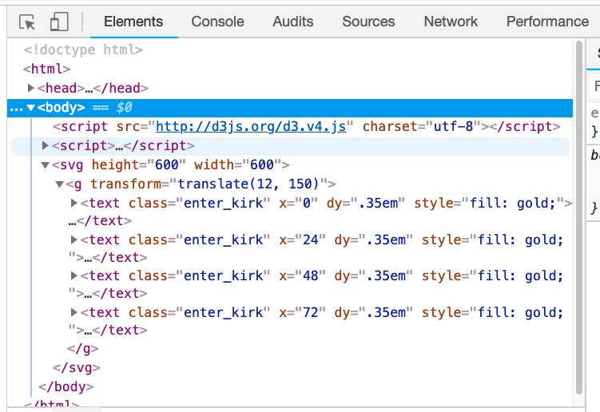

# Mastering The Data Join and the General Update Pattern

In this exercise, the Star Trek captains will help you to gain a better understanding of data-binding, with specific attention paid to `selection.enter()` and `selection.exit()`. 

You may find the following resources helpful along the way:

- [Thinking with Joins](https://bost.ocks.org/mike/join/) _(Bostock)_
- [Three little circles (intro description)](https://bost.ocks.org/mike/circles/)
- [General Update Pattern Example](https://bl.ocks.org/mbostock/3808218) _(Bostock)_

## A. Start a local Server
Start up a local server and open the [`genUpdateLab_starter.html`](genUpdate_starter.html) file from the `generalUpdatePattern` folder in a browser. Open up the developer tools. We'll be working within the console for this lab. 

## B. Define variables
We'll start by defining some variables that we'll use throughout this lab. Each variable will be the array of individual letters that make up the string. You can copy and paste these straight into the console.

```js
kirk = 'kirk'.split('');
picard = 'picard'.split('');
sisko = 'sisko'.split('');
janeway = 'janeway'.split('');
archer = 'archer'.split('');
```

To see what the variables look like, print some of them out in the console. After you've defined them, you can do this by simply typing "kirk" or one of the others into the console and hitting enter. 

**Important Note: Throughout this lab, you will be going back and forth between the Console and Elements tab in developer tools. Every time you add something new or change a class, make sure to look at the Elements tab so that you can see what's happening under the hood. There will often be things happening that do not change the appearance of the screen. Looking at the Elements tab throughout this lab is the best way to understand what's going on. All new code will be added in the Console.**

## C. Kirk - `enter`

1) create a text selection and bind the kirk data array.

`trekText = svg.selectAll('text').data(kirk);`

2) Check out the enter selection:

`trekText.enter();`

We are adding four new elements, and there are therefore four enter placeholder objects. If you continue to expand the selection, you can confirm that 'k', 'i', 'r', and 'k' are attached to the enter objects.

Or, if you don't want to have to keep expanding, you can enter the following from now on:

`trekText.enter()._groups[0]`

3) Check out the update selection:

`trekText.data();`

Because there are no elements in the DOM yet (you can verify this in the elements tab), there are no elements that need updated.

4) And finally, the exit selection:

`trekText.exit();`
Or, to skip the expanding...
`trekText.exit()._groups[0]`

Because there are no elements in the DOM yet, there are no elements that didn't recieve data, and therefore no elements that need to be removed.

5) Create new elements using enter selection and append operator

```
trekText = trekText.enter().append("text")
    .attr("class", "enter_kirk") //show that it's entering
    .attr("x",  function(d, i) { return i * 24; })
    .attr("dy", ".35em")
    .style("fill", "gold"); //Kirk wears a gold shirt, so he gets to be gold. :)
```

Although no text has appeared on the screen, you can check and see that there are now four text elements in the DOM, attached to each are one of the four `kirk` data values. **To verify this, go to your elements tab, expand the svg and g to see the bound text.** There should be no text on your screen, but you'll see them bound to the elements bound to the DOM like so:



6) Let's add the actual text:

`trekText.text(function(d) { return d; });`

We can see Kirk shows up nice and gold on the screen as we'd expect.

7) Now let's look at the update selection. When the append operator is run on the enter selection, the update selection expands to include the enter selection.

`trekText.data()`

8) Look at exit and enter selections
```
trekText.enter()._groups[0]
trekText.exit()._groups[0]
```
You'll notice these say "empty x 4". This is because D3 is keeping order for us, so we see 4 undefined data types. These represent the four elements in the DOM, none of which are part of the enter or exit selection. If this seems confusing, just keep going. It will likely seem more clear with future examples...

## D. Picard - `enter` and `update`

1) Let's bind data from the `Picard` string.

```
var trekText = svg.selectAll('text')
    .data(picard)
    .style('fill', 'red') //cuz he's a red shirt - also, color assocaited with updating selection
    .attr("class", "update_picard");
```

Expand SVG in browser. Notice that all of the elements had their class changed. Because there are more data points than elements, all the elements in the DOM changed to the new elements. All text was also updated with the specified color - red.

Also notice that the actual text has not changed, this is because we haven't re-written it.

Picard has 6 letters, so we are selecting 4 DOM elements and binding 6 data elements.This means that D3 is going to have to create placeholder elements for the last two elements.

2) Check exit selection.

`trekText.exit()._groups[0];`

As expected, nothing here. Because there are more data points than DOM elements, there were no DOM elements that didn't get their data updated

4) Check update selection.

`trekText.data()`

Because there were already four DOM elements, there are four elements that will be updated with the new data. Therefore, the update selection includes the first four data points of this array.

5) Check enter selection.

`trekText.enter()._groups[0];`

Because Picard has two more letters than Kirk, there are two new elements, and therefore two elements in the enter selection.

As mentioned before, D3 is keeping order for us, so we see 4 undefined data types (representing the four data points in the update selection), and then the two placeholder objects.

6) Next, let's add these placeholder objects to the web page (Create new elements using enter selection and append operator)

```
trekText = trekText.enter() //determines elements that are new to the dataset. As we saw above, there are two new elements.
    .append("text") //appends text for each entering text element
    .attr("class", "enter_picard")
    .attr("x",  function(d, i) { return i * 24; }) //x attributes
    .attr("dy", ".35em") //y attributes
    .style("fill", "darkred") //color associated with enter selection
  .merge(trekText) //merge update to apply changes to entering AND appending
    .text(function(d) { return d; }); //attach text
```

Breaking this down into discrete steps:

- Any existing text elements (that are descendants of the svg selection) are selected. (see step 1)
- These text elements are joined to new data, returning the matching text: the update selection. (see step 1)
- These updating text elements are given a red fill. (see step 1)
- New circles are appended for any new data that do not match any existing circle: the enter selection. (see step 6)
- These entering text elements are given a dark red fill. (see step 6)
- A new selection representing the union of entering and updating text elements is created. (see step 6)
- These text elements are stored in the variable `trekText`. (see step 6)

Now look at browser elements. You can see elements that were merely updated still say "update_picard"

Notice the last elements classes are "enter_picard". These are the elements just added

Notice the two colors represented on in the letters due to the red fill applied to the update selection and the dark red fill applied to the enter selection.

There are obviously no element in exit selection, so let's move on.

## E. Archer - `update` only

This time, we update with a string of same length so should have no exit or enter selection - just the update selection.

1) Bind data from the Archer string.

```
var trekText = svg.selectAll('text')
    .data(archer)
    .attr("class", "update_archer")
    .style('fill', 'gold') //cuz he's a gold shirt!
```

Look at the browser elements. Notice all elements had their class changed. This is because there is an equal amount of data points and DOM elements.

2) Check update selection.

`trekText.data()`

Notice all letters of `archer` are present.

2) Check enter and exit selections.

`trekText.enter()._groups[0];`
`trekText.exit()._groups[0];`

Because there are the same number of data and DOM elements, no placeholder elements are needed, and D3 doesn't need to create any new elements and there are no DOM elements that didn't get their data updated.

3) Since we don't have any entering data elements, we can skip past the typical `.enter.append('text')` and go staright to merge.

`trekText = trekText.merge(trekText).text(function(d) { return d; });`

See "archer" displayed across the screen in gold.

## F. Sisko - `update` and `exit`

1) Let's bind Sisko data.
```
var trekText = svg.selectAll('text')
    .data(sisko)
    .attr("class", "update_sisko")
    .style('fill', 'red')
```

Go to browser elements and check out the elements that were updated.

You'll notice that the first five elements receive a new class. The rest didn't get updated. Also, the text still reads "Picard" because the text wasn't updated.

2) Check exit selection.

`trekText.exit()._groups[0];`

We can see that it contains one element. If you expand into the array and scroll down to the bottom to `__data__`, we see that the DOM element that did not recieve an updated data point was the 6th element ("r"). This is what we would expect. Since the `archer` variable contains 6 data points, but `sisko` contains only five, there is one element that did not recieve an updated data point.

Let's give the element in the exit selection a new class.

`trekText.exit().attr("class", "exit_sisko")`

Go to browser elements and take note that the class of the last text element was updated to reflect that it's in the exit selection.

3) Check update selection.

`trekText.data()`

Since there are more DOM elements than data values, all of the data values exist in the update selection.

4) Check the enter selection.

`trekText.enter()._groups[0];`

As expected, there are no elements in the enter selection. Since there are fewer data values than DOM elements, no new placeholder elements were created, so no enter selection elements should exist.

5) Update text of SVG elements.

`trekText.merge(trekText).text(function(d) { return d; });`

Notice the data of the DOM elements were replaced by the new data values. 

However, the exit selection still remains. We need to remove it.

6) Remove exit selection.

`trekText.exit().remove();`

We are now left with just the `sisko` text.

## Repeat?

This is tricky stuff, but it is a core building block of d3. Feel free to walk through this tutorial a second time if you think it would help. 
