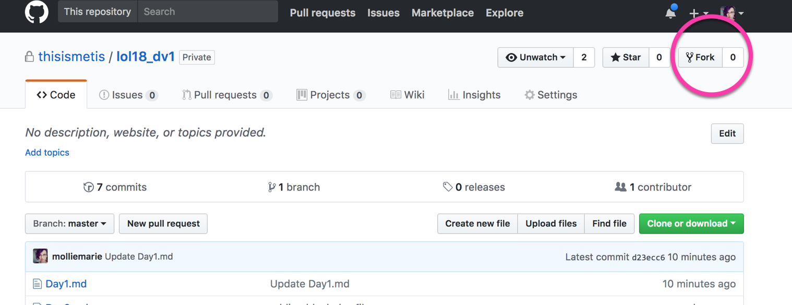
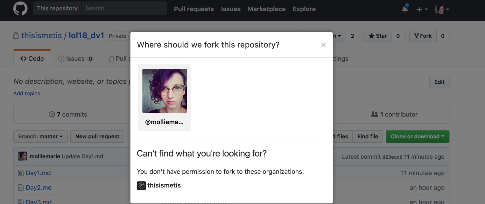
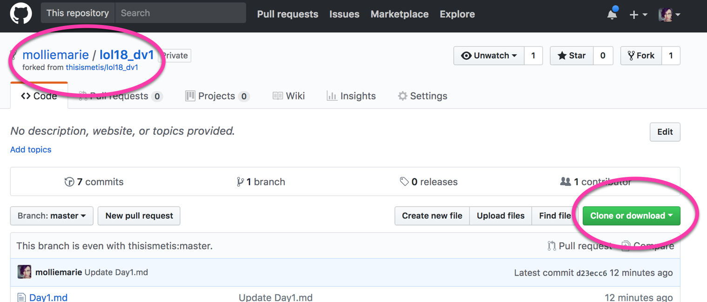
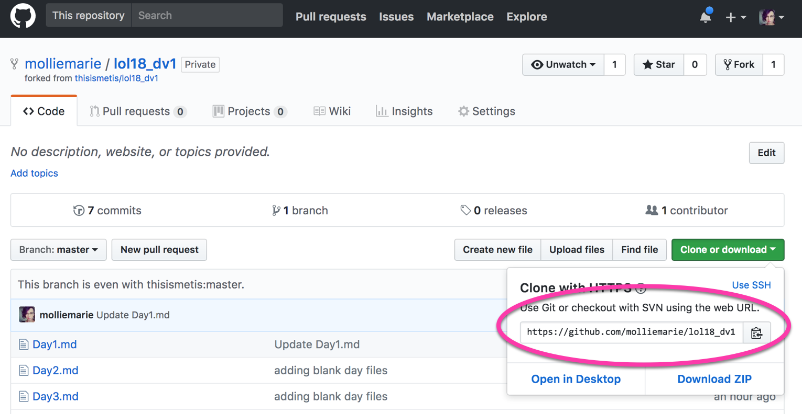

 # Technical Set up
 
 In order to follow along in class, you'll be using files in this course repository. Let's make sure our computers are configured correctly. You should have a [Github account](https://github.com), know how to set up a [local server](https://github.com/thisismetis/chi17_dataviz1/blob/master/local_server.md), use a text editor and use the Chrome Web inspector. 
 
 
  ## GitHub
 Before we get started, we need to make sure you have access to the repository. Here are a list of steps to get that all set up. :) 

### Fork this repository:

At the top of this page, you'll see a button that says "fork", like so:



Click it! It will then ask where you should fork the repository. Click on yourself. 

For instance, this is what I saw:



### Clone this repository:
 
After the last steps, you should have been redirected to your new forked class repository. You'll notice your github id in the name of the repo, in the top left corner (as pictured). 



You can now click on the green "clone" button, from which a modal will appear that says "Use Git or checkout with SVN using the web URL" followed by a link. The link should be something like `https://github.com/YOUR-USER-NAME/MSIA-D3Course-2019.git`. Copy it.



 ```bash
 # In the terminal, clone *your repo* onto your machine after forking it
git clone https://github.com/YOUR-USER-NAME/MSIA-D3Course-2019.git
 ```
 
### Setting upstream

Inevitably, I'll be making changes to the course repository, which means you should **set the upstream remote**:

 ```bash
 # Add the *course repo* as the upstream
git remote add upstream https://github.com/molliemarie/MSIA-D3Course-2019.git
 ```
 
The reasons we do this is as follow: 

You’ve created a fork of the original class repository. So, if you just run `git pull`, all you’re doing is pulling from your own forked repository, to which there are no new updates.

What you’re doing with that above command is setting the class repo as the “upstream”, so when you pull, you are getting the new information from the class repo rather than from your own repo (which is likely already up to date on your computer since nobody else is contributing to it).
 
### Pushing Changes

Then later, if you make your own changes to the documents and want to commit them to your forked Github repository, you can do that by running:

 ```bash
# Commit the changes you've made
git add *
git commit -m "Descriptive note on what your changes are" 
```

Note: The asterisk in `git add *` means that you add all of your changes. 

### Pulling Updated Coursework

Later in the course, when I make changes to the course content, you'll be able to **pull** in those changes to your forked repository, and replay your changes on top of them with the following command:

 ```bash
# Pull in changes from upstream location, and play changes on top of them
git pull --rebase upstream master
```
